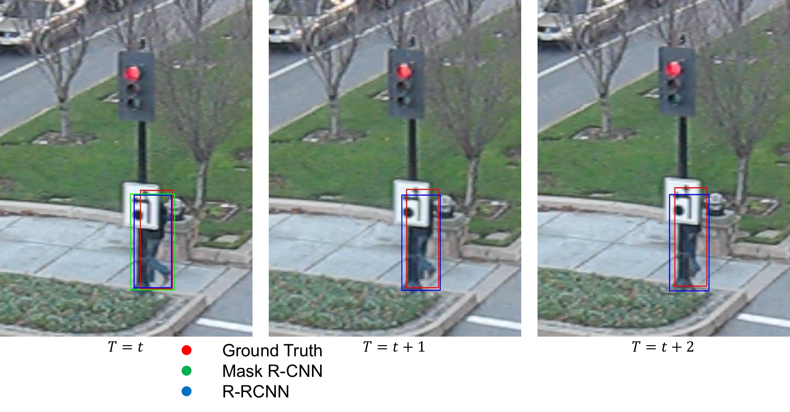

# Recurrent Region CNN for Single Object Tracking  
This project is inspired by [ROLO](https://github.com/Guanghan/ROLO). In this project, we build a single object tracking system consisting of a detection module and a tracking module.

[Mask R-CNN](https://arxiv.org/abs/1703.06870) was published in March 2017, by [Facebook AI Research(FAIR)](https://research.fb.com/category/facebook-ai-research/). We uses a python [implementation of Mask R-CNN](https://github.com/matterport/Mask_RCNN) released by [Matterport Inc.](https://matterport.com/) as the detection module. 

Consisting of two LSTM networks, the tracking module utilizes the spatial constraints from the detection module and follows the temporal dynamics of object motions to predict location offsets of the tracked objects.

  

  

## Requirements
+ Python 3.4.3
+ CUDA 8.0
+ cuDNN v5.1
+ [Tensorflow 1.4](https://www.tensorflow.org/versions/r1.4/)
+ [Keras 2.1.2](https://keras.io/)
+ OpenCV 3.4
+ Python virtualenv [Optional]
+ Common packages listed in ```requirements.txt```

## Installation
1. Clone the R-RCNN repository  
```
git clone https://github.com/cechung/R-RCNN.git
```

2. Create a virtual enviroment
```
mkvirtualenv $RRCNN_ENV -p python3
workon $RRCNN_ENV
```

3. Install dependencies
```
cd $RRCNN_ROOT
pip install --upgrade pip
pip install -r requirements.txt
```

4. Download pre-trained COCO weights [mask_rcnn_coco.h5](https://drive.google.com/file/d/1huU5RHR5BqOYRCAku1JzeXXm_DDTCDVS/view?usp=sharing) for Mask R-CNN.

5. Download pre-trained OTB weights [RRCNN_OTB+.h5](https://drive.google.com/file/d/1g0Yxrs4YeA9ft_1Lul-JRNZvEMcIE781/view?usp=sharing) for R-RCNN.

6. Download [demo video frames](https://drive.google.com/file/d/11UcNXvNC0-Ve7VFk52VQMNvcainhHNy1/view?usp=sharing) for demo.

## Demo
After successfully completing [Installation](#installation), you'll be ready to run the demo. 

1. Demo of R-RCNN. The results should be stored in ```$RRCNN_ROOT/demo_result```.
```
cd $RRCNN_ROOT
python demo_rrcnn.py
```

2. Demo of Mask R-CNN. The results should be stored in ```$RRCNN_ROOT/mrcnn_result```.
```
cd $RRCNN_ROOT
python demo_mrcnn.py
```

## Training
+ Mask R-CNN is pre-trained on MS COCO, and the pre-trained weights are provided by [Matterport Inc.](https://matterport.com/)  
If you have any questions or want to pre-train Mask R-CNN on other datasets, please refer to [their GitHub](https://github.com/matterport/Mask_RCNN).

+ We only provide the training method of the tracking module. 

	1. The training code is in ```$RRCNN_ROOT/train_trackmodel.py```
	
	2. The main tracking module implementation is in ```$RRCNN_ROOT/tracking_module/track_model.py```. 
	
	4. The config of tracking module is in ```$RRCNN_ROOT/tracking_module/track_config.py```.

+ Before start of training, you need to prepare ```$RRCNN_ROOT/Detection_DATA```, which is a folder with ```.npy``` format files generated by the detection module. 

	1. Numpy files in ```Detection_DATA/true_bbox``` store **Object Locations** of the target, detected by the detection module, with format (y, x, h, w).  
	If the detection module fails to detect the target, use (0, 0, 0, 0) instead.

	2. Numpy files in ```Detection_DATA/bbox``` store **Object Locations** of the target with ***All Frames**, with format (y, x, h, w).  
	If the detection module fails to detect the target, use the target information of the previous frame.  
    ***All Frames**: Ensure that the tracking module always has input.
	
	2. Numpy files in ```Detection_DATA/features``` store **Features**, with size 1024.

	3. Numpy files in ```Detection_DATA/bbox_GT``` store **Ground Truth** locations of the target, with format (y, x, h, w). 

+ After preparation, you need to append training and validation video names to ```train_names``` and ```val_names``` in ```train_trackmodel.py```.

+ Start training. The trained weights will be stored in ```$RRCNN_ROOT/logs```.
```
# Train the model starting from pre-trained OTB weights
python train_trackmodel.py -w RRCNN_OTB+.h5

# Train the model starting from scratch
python train_trackmodel.py -w None
```

## Evaluation
+ We provide evaluation implementation for trained weights of R-RCNN to compute average overlap score (AOS).  
Code is in ```$RRCNN_ROOT/evaluation_rrcnn.py```.

+ Same as [Training](#training), you need to prepare **Detection DATA** of validation dataset.

+ Start evaluation. The tracking bbox results will be stored in ```$RRCNN_ROOT/RRCNN_results```.
```
# Evaluation of RRCNN_OTB+.h5
python evaluation_rrcnn.py -w RRCNN_OTB+.h5
```

+ After evaluation, we also provide visualization implementation to draw bboxes of Ground Truth, Mask R-CNN, R-RCNN.  
Code is in ```$RRCNN_ROOT/draw_bbox.py```.

+ Start visualization. The visualization image results will be stored in ```$RRCNN_ROOT/RRCNN_results```.
```
# Visualization of RRCNN_OTB+.h5
python draw_bbox.py -w RRCNN_OTB+.h5
```


